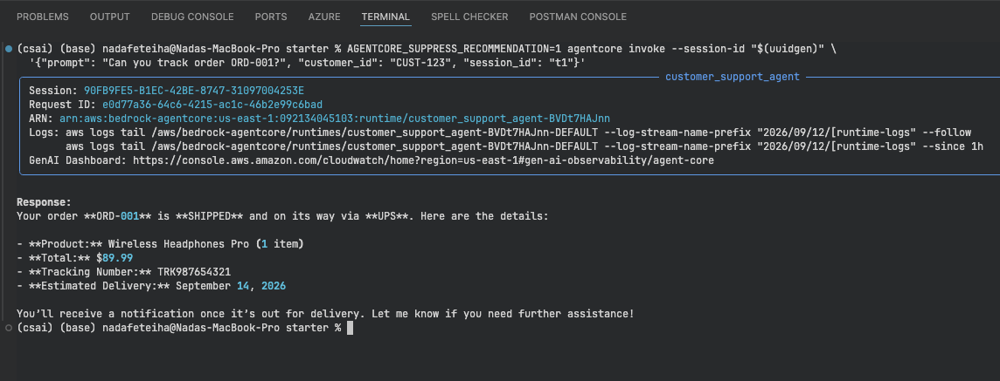
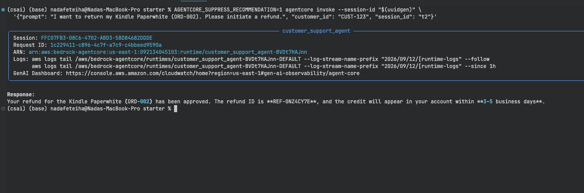
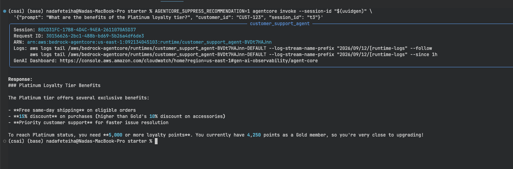
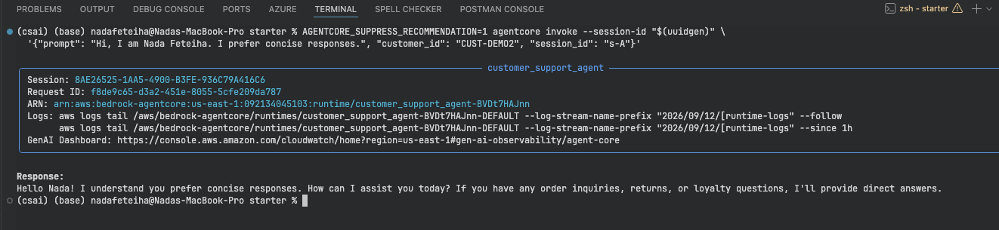
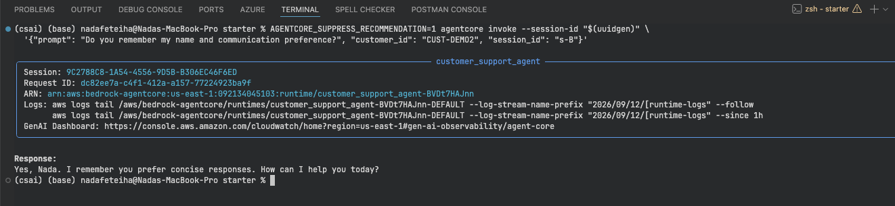
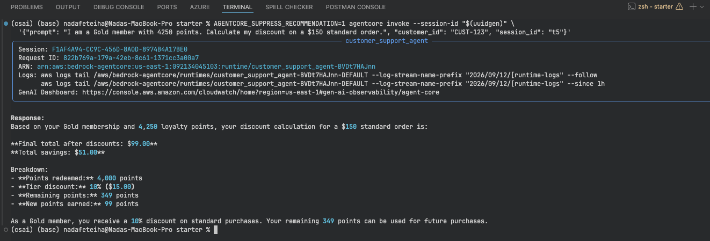
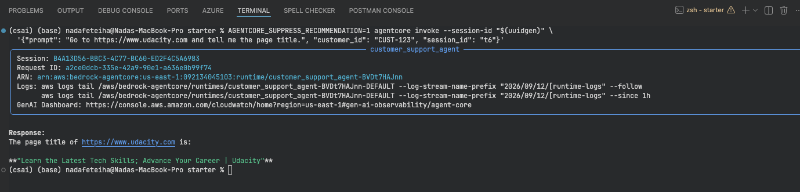

# Customer Support AI Agent — Amazon Bedrock AgentCore Project

Udacity AWS AI Engineering Nanodegree, Course 2.

This is my submission for the customer support agent project. I built and
deployed the agent described in the project instructions using Amazon Bedrock
AgentCore, the Strands SDK, and a handful of AWS services (Lambda, API
Gateway, Bedrock Knowledge Bases, AgentCore Memory, Code Interpreter, and the
AgentCore Browser tool).

Agent ARN: `arn:aws:bedrock-agentcore:us-east-1:092134045103:runtime/customer_support_agent-BVDt7HAJnn`

## What it does

- Tracks orders and processes refunds through Lambda functions wired up as
  Gateway tools (MCP)
- Answers product/policy questions using a Bedrock Knowledge Base (RAG)
- Remembers customer name and preferences across separate sessions
- Calculates loyalty discounts with exact math using the Code Interpreter
- Can browse a live web page and read back what it finds

## Task status

| Task | Done? |
|---|---|
| 1. App init + clients (TODO 1-3) | Yes |
| 2. Namespace helper (TODO 4) | Yes |
| 3. MemoryHook class (TODO 5) | Yes |
| 4. Knowledge Base search tool (TODO 6) | Yes |
| 5. Loyalty discount calculator (TODO 7) | Yes |
| 6. Agent entrypoint (TODO 8) | Yes |
| 7. Deploy + run all 6 test scenarios | Yes |
| 8. Written reflection | Yes |

Test results (real command + real output for all 6 scenarios): [`test_logs/test_results.md`](test_logs/test_results.md)

Reflection: [`REFLECTION.md`](REFLECTION.md)

## Extra stuff beyond the base requirements

The project suggests a few optional additions to go further. I did two of them:

- **Structured output validation.** `calculate_loyalty_discount` now returns
  results validated against a Pydantic model (`DiscountResult`) with all the
  required fields (`points_redeemed`, `tier_discount_pct`, `final_total`,
  `remaining_points`, plus `total_savings`/`points_earned`/`note`). This also
  fixed a bug I found while doing it — the tool used to return the Code
  Interpreter's raw response wrapper instead of the actual numbers.
- **Conversation summarization.** The agent now uses Strands'
  `SummarizingConversationManager` so that if a single request chains a lot of
  tool calls (the browser tool especially can take several steps), older
  messages get summarized instead of just dropped or blindly kept, which
  keeps token usage under control.

I did the third one too (domain personalization), but kept it as a totally
separate deployment so it doesn't touch this graded submission at all:
[`hotel_variant/`](hotel_variant/) is the same agent re-themed for a hotel —
reservations instead of orders, cancellations instead of refunds, guest
rewards instead of loyalty discount. Same architecture, own
Lambdas/Gateway/Knowledge Base/Memory/Runtime, own test results in
[`hotel_variant/TEST_RESULTS.md`](hotel_variant/TEST_RESULTS.md). While
testing that one I actually caught something interesting — see the note at
the bottom of this README.

## Project structure

```
project/
├── README.md
├── REFLECTION.md
├── test_logs/
│   ├── test_results.md
│   └── test*.png            (screenshots for each test)
├── starter/                  (the graded submission)
│   ├── main.py                (the completed agent)
│   ├── pyproject.toml
│   ├── product_catalog.txt    (uploaded to S3, synced into the Knowledge Base)
│   └── lambda/
│       ├── order_tracker.py
│       ├── refund_processor.py
│       └── lambda_schema
└── hotel_variant/             (bonus: same agent, hotel domain, separate deployment)
    ├── README.md
    ├── TEST_RESULTS.md
    ├── main.py
    ├── pyproject.toml
    ├── hotel_policies.txt
    └── lambda/
        ├── reservation_tracker.py
        ├── cancellation_processor.py
        └── lambda_schema
```

## AWS resources I actually deployed

| Resource | Value |
|---|---|
| Region | `us-east-1` |
| Lambda (orders) | `order-tracker` |
| Lambda (refunds) | `refund-processor` |
| API Gateway REST API | `chcb0zkb9b`, stage `prod` |
| AgentCore Gateway | `customersupportgateway-zh3m74vmjj`, NONE authorizer, 2 targets (order-tracker API Gateway target + refund-processor Lambda target), 6 MCP tools total |
| Knowledge Base | `CustomerSupportKB`, ID `USCGD9ZEJ1` |
| AgentCore Memory | `CustomerSupportMemory-L1eStICBN4`, strategies `customer_facts` (semantic) and `customer_preferences` (user preference) |
| AgentCore Runtime | `customer_support_agent-BVDt7HAJnn`, Direct Code Deploy, Python 3.11 |

Model used: Amazon Nova Lite (`global.amazon.nova-2-lite-v1:0`).

Checking Gateway tools:
```bash
npx @modelcontextprotocol/inspector
# connect to the Gateway URL, should list 6 tools
```

Checking the Knowledge Base directly:
```bash
aws bedrock-agent-runtime retrieve \
  --knowledge-base-id USCGD9ZEJ1 \
  --retrieval-query '{"text": "What is the return policy for electronics?"}' \
  --region us-east-1
# should mention the 15-day electronics return window
```

## Local setup / deploy

```bash
cd starter
uv sync
AGENTCORE_SUPPRESS_RECOMMENDATION=1 agentcore configure --entrypoint main.py --name customer_support_agent
AGENTCORE_SUPPRESS_RECOMMENDATION=1 agentcore deploy
```

## Running the 6 test scenarios yourself

These commands are copy-pasteable. Run them one at a time from the `starter/`
folder. `$(uuidgen)` just generates a fresh session id each time — AgentCore
needs the `--session-id` flag to be at least 33 characters.

**Test 1 — Order Tracking**
```bash
AGENTCORE_SUPPRESS_RECOMMENDATION=1 agentcore invoke --session-id "$(uuidgen)" \
  '{"prompt": "Can you track order ORD-001?", "customer_id": "CUST-123", "session_id": "t1"}'
```


**Test 2 — Refund Processing**
```bash
AGENTCORE_SUPPRESS_RECOMMENDATION=1 agentcore invoke --session-id "$(uuidgen)" \
  '{"prompt": "I want to return my Kindle Paperwhite (ORD-002). Please initiate a refund.", "customer_id": "CUST-123", "session_id": "t2"}'
```


**Test 3 — Knowledge Base (RAG)**
```bash
AGENTCORE_SUPPRESS_RECOMMENDATION=1 agentcore invoke --session-id "$(uuidgen)" \
  '{"prompt": "What are the benefits of the Platinum loyalty tier?", "customer_id": "CUST-123", "session_id": "t3"}'
```


**Test 4 — Long-Term Memory (needs two calls, two screenshots)**

Session A, introduce yourself:
```bash
AGENTCORE_SUPPRESS_RECOMMENDATION=1 agentcore invoke --session-id "$(uuidgen)" \
  '{"prompt": "Hi, I am Nada Feteiha. I prefer concise responses.", "customer_id": "CUST-DEMO2", "session_id": "s-A"}'
```


Wait about a minute for memory extraction to run, then Session B (brand new session, same customer_id), to check recall:
```bash
AGENTCORE_SUPPRESS_RECOMMENDATION=1 agentcore invoke --session-id "$(uuidgen)" \
  '{"prompt": "Do you remember my name and communication preference?", "customer_id": "CUST-DEMO2", "session_id": "s-B"}'
```


**Test 5 — Loyalty Discount Calculation**
```bash
AGENTCORE_SUPPRESS_RECOMMENDATION=1 agentcore invoke --session-id "$(uuidgen)" \
  '{"prompt": "I am a Gold member with 4250 points. Calculate my discount on a $150 standard order.", "customer_id": "CUST-123", "session_id": "t5"}'
```


**Test 6 — Browser Tool**
```bash
AGENTCORE_SUPPRESS_RECOMMENDATION=1 agentcore invoke --session-id "$(uuidgen)" \
  '{"prompt": "Go to https://www.udacity.com and tell me the page title.", "customer_id": "CUST-123", "session_id": "t6"}'
```
(This one takes a bit longer, the browser session has to spin up first.)



## Notes / gotchas I ran into

- The AgentCore CLI's own `--session-id` needs to be 33+ characters, otherwise
  it errors out. I use `uuidgen` for that.
- If you reuse the same `customer_id` for a lot of testing, the memory system
  starts injecting older, unrelated facts into new conversations because
  `retrieve_customer_context` has no relevance threshold. Use a fresh
  `customer_id` when you want a clean memory demo.
- The browser tool needs a `session_name` matching `^[a-z0-9-]+$`, 10-36
  characters. I added a line in the system prompt telling the model this
  explicitly, otherwise it sometimes picked an invalid name and just gave up
  after the first error instead of retrying.
- More detail on both of these is in `REFLECTION.md`.
- While testing the discount calculation on the hotel variant, one run came
  back with the wrong final numbers even though I'd already verified the
  tool itself always computes correctly. A retry on the exact same prompt
  gave the right answer. Looks like Nova Lite occasionally messes up when
  turning a correct tool result into a sentence, rather than an actual bug —
  see `hotel_variant/TEST_RESULTS.md` for the details.

## References

- [Amazon Bedrock AgentCore Documentation](https://docs.aws.amazon.com/bedrock/latest/userguide/agentcore.html)
- [Strands Agents Documentation](https://strandsagents.com)
- [MCP Inspector](https://github.com/modelcontextprotocol/inspector)
- [uv Package Manager](https://docs.astral.sh/uv/)
